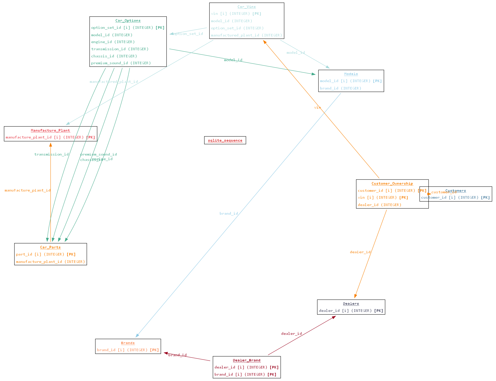
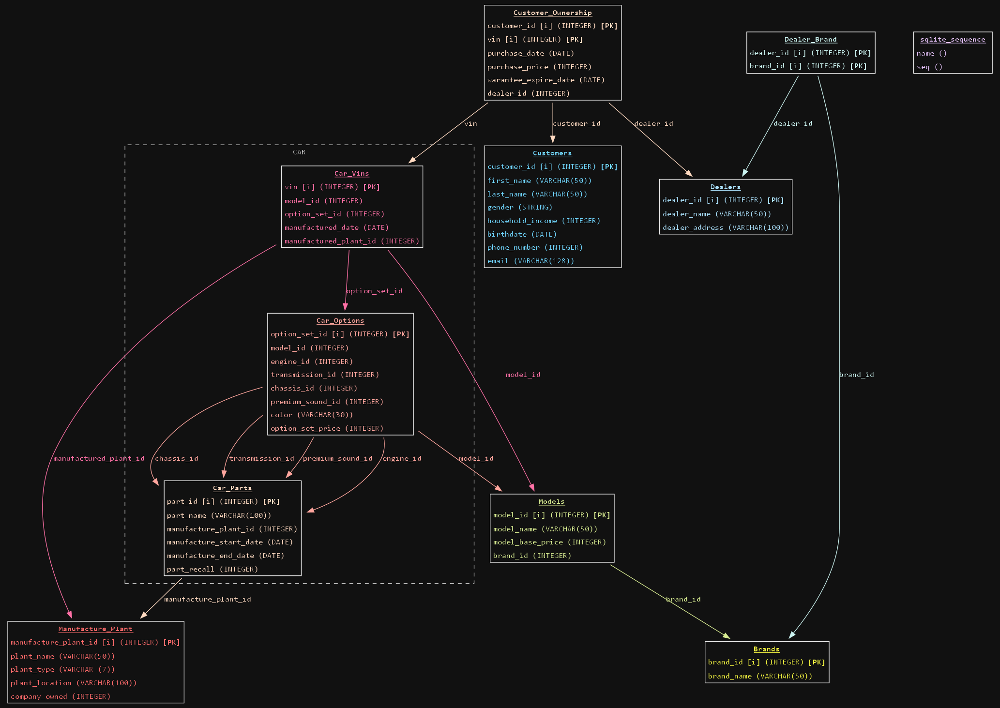

# DB Mapper

A Python tool that creates hierarchical diagrams from SQLite databases or SQL schema files.

## Features

- Parse SQLite database files (`.db`, `.sqlite`, `.sqlite3`)
- Parse SQL files containing CREATE TABLE statements
- Generate hierarchical diagrams showing table relationships
- Display column information including data types and constraints
- **Assume relationships** based on column naming patterns (e.g., `user_id` → `users`)
- **Colorful and dark mode** output for better visualization
- **Cluster tables** by prefix for better organization
- **Customizable font** for all diagram text
- **Customizable arrow style**: choose between curved, straight, or right-angled connectors
- **Customizable layout engine**: choose from `dot`, `neato`, `fdp`, `sfdp`, `twopi`, `circo`
- **Adjustable node and rank spacing** for fine-tuned diagram density
- **Overlap handling** for force-directed layouts
- **Adjustable image resolution (DPI)** for high-quality output
- **Show indexed columns**: display an [i] marker after indexed columns with `--show-indexes`
- **Sort tables by incoming connections** for more central placement of referenced tables
- **Relationship label styles**: real foreign keys are **bold**, assumed are *italic* (with `--assume`)
- **Generate SQL for missing foreign keys** with `--create-keys` and `--create-sqlite-keys`
- **Interactive mode** with user-friendly menus and detailed help
- **Comprehensive help system** explaining all options and best practices

## Installation

1. Clone this repository
   ```bash
   git clone https://github.com/WolfyD/db_mapper.git
   cd db_mapper
   ```
2. Install the required dependencies:
   ```bash
   pip install -r requirements.txt
   ```

3. Install Graphviz on your system (see https://graphviz.org/download/)
  
   Make sure that the executable path is added to the Path environmental variable

4. (Optional) For interactive mode, install InquirerPy:
   ```bash
   pip install InquirerPy
   ```

## Usage

### Interactive Mode

The easiest way to use DB Mapper is through the interactive menu:

```bash
python db_mapper.py -i
```

This will guide you through:
1. Selecting your database/SQL file
2. Choosing the main action:
   - Generate database diagram
   - Generate SQL for missing foreign keys
   - Generate SQLite FOREIGN KEY clauses
   - Generate suggested indexes
   - Generate suggested triggers
   - Show detailed help
3. Configuring diagram options:
   - Basic options (colors, dark mode, etc.)
   - Layout direction
   - Layout engine
   - Arrow style
   - Font selection
   - Advanced options (spacing, DPI, etc.)

### Command Line

```bash
python db_mapper.py <input_file> [options]
```

#### Options

- `--output, -o <name>`: Output file name (without extension)
- `--assume, -a`: Assume relationships based on column naming patterns
- `--color, -c`: Assign a unique color to each table and its outgoing arrows
- `--dark, -d`: Use a dark background and light foreground
- `--full, -f`: Show all columns and increase spacing between tables
- `--font <fontname>`: Font to use for diagram. Options: 
  - `Arial`, 
  - `Helvetica`
  - `Consolas`
  - `Courier`
  - `Times`
  - `Verdana`
  - `Tahoma`
  - `Trebuchet MS`
  - `Georgia`
  - `Palatino`
  - `Impact`
  - `Comic Sans MS`
- `--arrow-type, -t <type>`: Arrow style for connections. Options:
  - `curved` (default): Curved arrows (works with all engines)
  - `polyline`: Straight arrows (only for dot engine)
  - `ortho`: Right-angled (orthogonal) arrows (only for dot engine)
- `--engine <engine>`: Graphviz layout engine. Options:
  - `dot` (default, hierarchical, best for most diagrams)
  - `neato` (force-directed, good for small to medium graphs)
  - `fdp` (force-directed, good for large graphs)
  - `sfdp` (force-directed, best for very large graphs)
  - `twopi` (radial, good for hierarchical data)
  - `circo` (circular, good for cyclic structures)
- `--nodesep <int>`: Minimum space between nodes (default: 6 for 0.6). Enter 8 for 0.8, 15 for 1.5, etc. Anything below 1 is treated as 1 (0.1). Especially useful for force-directed engines.
- `--ranksep <int>`: Minimum space between rows/columns (default: 7 for 0.7). Enter 10 for 1.0, 15 for 1.5, etc. Anything below 1 is treated as 1 (0.1). Especially useful for force-directed engines.
- `--overlap <mode>`: Node overlap handling (especially useful for neato/fdp/sfdp). Options:
  - `false`: No overlap allowed
  - `scale`: Reduce overlap by scaling
  - `prism`: Force-directed overlap removal
  - `compress`: Reduce size to avoid overlap
  - `vpsc`: Variable overlap removal
  - `ortho/orthoxy/ortho_yx`: Orthogonal layouts
  - `pcompress`: Parallel compression
  - `ipsep`: Incremental separation
  - `sep/sep+`: Separation methods
  - `true`: Allow overlap
- `--font-size <int>`: Font size for all diagram text (default: 12). Increase for larger text, decrease for smaller.
- `--dpi <int>`: Image resolution in DPI (default: 96). Increase for higher quality PNG output.
- `--show-indexes`: Show an [i] symbol after columns that are indexed (PK or have an explicit index).
- `--sort-by-incoming`: Sort tables by number of incoming connections (off by default). Enable for more central placement of referenced tables.
- `--create-keys`: Print SQL statements to create all assumed foreign keys and exit. **All other flags are ignored.**
- `--create-sqlite-keys`: Print assumed FOREIGN KEY clauses for each table (for SQLite CREATE TABLE) and exit. **All other flags are ignored.**
- `--interactive, -i`: Launch an interactive menu to select actions and options instead of using flags. All features are available in both modes.

#### Relationship Label Styles
- When using `--assume`, explicit (real) foreign keys are shown in **bold**; assumed relationships are shown in *italic*.

#### Example

```bash
python db_mapper.py schema.sql --assume --color --dark --full --font Arial --arrow-type ortho --engine dot --nodesep 8 --ranksep 10 --overlap scale --font-size 14 --dpi 150 --show-indexes --sort-by-incoming -o my_diagram
```

#### Example: Generate SQL for missing foreign keys

```bash
python db_mapper.py schema.sql --create-keys
```
This will print a transaction-wrapped list of `ALTER TABLE ... ADD CONSTRAINT ... FOREIGN KEY ... REFERENCES ...` statements for all assumed relationships:

```
BEGIN;
ALTER TABLE child_table
ADD CONSTRAINT fk_child_table_parent_table
FOREIGN KEY (child_column) REFERENCES parent_table(parent_column);
...
COMMIT;
```

#### Real examples
using [car_company_database](https://github.com/dtaivpp/car_company_database) by [dtaivpp](https://github.com/dtaivpp)

```bash
python db_mapper.py Car_Database.db --color -o car_database_diagram -l TB --engine circo --show-indexes
```
Color diagram, using the Circo engine


```bash
python db_mapper.py Car_Database.db --color -o car_database_diagram_dark -l TB --show-indexes --full --dark 
```
Dark color diagram, using the dot engine 


If the database didn't already have keys, you could run the following to generate them
```bash
python db_mapper.py Car_Database.db --create-sqlite-keys
```
>Models:
>
>     FOREIGN KEY (brand_id) REFERENCES Brands(brand_id)
>
>Customer_Ownership:
>    
>     FOREIGN KEY (customer_id) REFERENCES Customers(customer_id),
>     FOREIGN KEY (dealer_id) REFERENCES Dealers(dealer_id)
>
>Dealer_Brand:
>     
>      FOREIGN KEY (dealer_id) REFERENCES Dealers(dealer_id)
>
>Car_Parts:
>
>     FOREIGN KEY (manufacture_plant_id) REFERENCES Manufacture_Plant>(manufacture_plant_id)
>
>Car_Options:
>
>     FOREIGN KEY (model_id) REFERENCES Models(model_id)
>
>Car_Vins:
>
>     FOREIGN KEY (model_id) REFERENCES Models(model_id)
>

### Python API

```python
from db_mapper import DatabaseMapper

mapper = DatabaseMapper()
mapper.parse_sqlite_db('path/to/your/database.db')
# or
mapper.parse_sql_file('path/to/your/schema.sql')
mapper.generate_diagram('output_filename')  # Will create output_filename.png
```

## Requirements

- Python 3.6+
- sqlparse
- graphviz (Python package and system install)
- InquirerPy (for interactive CLI mode)

## Output

The tool generates a PNG file containing a hierarchical diagram of your database schema, showing:
- Tables and their columns (all columns or just relational, depending on flags)
- Column data types and constraints
- Relationships between tables (explicit using Fk and/or assumed based on naming conventions)
- Optional: color, dark mode, custom font, and custom arrow style

## Tips

1. For large databases:
   - Use SFDP engine
   - Enable compact layout
   - Use overlap handling
   - Consider showing only relational columns

2. For better readability:
   - Use dark mode for light backgrounds
   - Increase font size
   - Use higher DPI for better quality
   - Enable colors for better distinction

3. For force-directed layouts:
   - Adjust node and rank separation
   - Use appropriate overlap handling
   - Consider using curved arrows

4. For hierarchical data:
   - Use dot engine with TB layout
   - Consider using ortho arrows
   - Enable sort by incoming connections

---

 ### Disclaimer:
 AI tools were used in the making of db_mapper
 
 ---